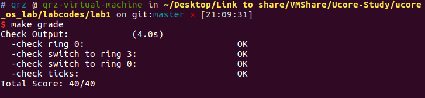

扩展练习对于我这种一点基础都没有的人来说还真是有点吃力。。我分析了一些报告和相关的知识，从几个方面阐述我的想法。

对于问题 1，根据 `switch_test` 函数，可以发现最重要的是实现 `init.c` 中的 `lab1_switch_to_user` 函数、 `lab1_switch_to_kernel` 函数和 `trap.c` 中 `trap_dispatch` 对 `case T_SWITCH_TOU, T_SWITCH_TOK` 的处理。

权限的切换在中断时进行，我们需要理解中断前后都进行了什么操作。

在不涉及到特权级的切换时，堆栈变化的情况如下：

```
Stack Usage with No Privilege-Level Change
Interrupted Procedure's and Handler's Stack
+------------+
|            |
+------------+
|            +<------+ ESP Before Transfer to Handler
+------------+
|    EFLAGS  |
+------------+
|      CS    |
+------------+
|     EIP    |
+------------+
| Error Code +<------+ ESP After Tramsfer to Handler
+------------+
|            |
+------------+
|            |
+------------+
```

可以看到，栈是不变的，而在保存现场时按顺序压入了 EFLAGS、CS、EIP、Error Code。

在涉及到特权级转换时，堆栈变化情况如下：

```
     Stack Usage with Privilege-Level Change
Interrupted Procedure's                 Handler's
     Stack                                Stack
+------------+                        +------------+
|            |                        |            |
+------------+                        +------------+
|            |<--ESP Before           |            |
+------------+   Transfer to Handler  +------------+
|            |                        |     SS     |
+------------+                        +------------+
|            |                        |     ESP    |
+------------+                        +------------+
|            |                        |   EFLAGS   |
+------------+                        +------------+
|            |                        |     CS     |
+------------+                        +------------+
|            |                        |     EIP    |
+------------+                        +------------+
|            |            ESP After-->| Error Code |
+------------+  Tramsfer to Handler   +------------+
|            |                        |            |
+------------+                        +------------+
```

此时会切换到相应特权级的栈中，在切换栈后，除了上述的四个参数之外还会额外压入 SS、ESP 两个参数，还是比较好理解的，因为恢复的时候需要切换回原来的栈。

不过我整理完上面的知识之后发现我陷入了一个误区，这是通常情况下的中断处理方式，不是 ucore 的。有关 ucore 的处理我们可以在[这里](<https://chyyuu.gitbooks.io/ucore_os_docs/content/lab1/lab1_3_3_3_lab1_interrupt.html>)找到。

其中，文档写道：

> 所有的中断在经过中断入口函数__alltraps预处理后 (定义在 trapasm.S中) 

其实新版的 trapasm.S 已经被重命名为 trapentry.S 了。

接下来我们分析 __alltraps 这个预处理干了些啥

首先它按顺序压入了 ds、es、fs、gs，接着调用 pusha，压入通用寄存器。

接下来它将 GD_KDATA ——内核数据段压入 ds 和 es 中以初始化内核数据段，再将压入 `trap()` 函数的参数 tf（esp 指向的地址），调用 `trap` 函数正式开始中断。

此时我们可以发现 esp 指向的地址就是刚才压进去的那些参数，其中的 padding 存在的原因是我们只需要用到低 16 位而压进去的时候用了 pushl。这太神奇了，我是第一次见到这种用法，记下来了。

而对于我们的问题，具体来讲，从用户态切换到内核态的时候，我们可以在中断处理函数执行的过程中修改相关的寄存器的值，在中断处理结束，恢复现场的时候就可以切换用户态和内核态啦。

特权级检查方法如下图所示：


那么这个时候切换的逻辑就可以写出来了。

```c
case T_SWITCH_TOU:
    if((tf->tf_cs & DPL_USER) != DPL_USER){
        tf->tf_ds = tf->tf_es = tf->tf_fs = tf->tf_gs = tf->tf_ss = USER_DS;
        tf->tf_cs = USER_CS;
        tf->tf_eflags |= FL_IOPL_MASK;
    }
	break;
```

上述代码其实也不难理解。而根据[保护模式和分段机制](<https://chyyuu.gitbooks.io/ucore_os_docs/content/lab1/lab1_3_2_1_protection_mode.html>)中的内容，我们还要保证 CPL、DPL 与 RPL 的一致性。除此之外，在[Intel 80386寄存器](<https://chyyuu.gitbooks.io/ucore_os_docs/content/lab0/lab0_2_5_3_intel_80386_registers.html>)中的 EFLAGS 寄存器里有一个 I/OPL 字段也和操作权限有关：

> ```
> IOPL(I/O Privilege Level)：I/O特权级字段，它的宽度为2位,它指定了I/O指令的特权级。如果当前的特权级别在数值上小于或等于IOPL，那么I/O指令可执行。否则，将发生一个保护性故障中断；
> ```

同理，切换到内核态的函数也不难写出：

```c
case T_SWITCH_TOK:
	if((tf->tf_cs & DPL_USER) !=  DPL_KERNEL){
        tf->tf_ds = tf->tf_es = tf->tf_fs = tf->tf_gs = tf->tf_ss = KERNEL_DS;
        tf->tf_cs = KERNEL_CS;
        tf->tf_eflags &= ~(FL_IOPL_MASK);
    }
    break;
```

接下来我们就可以实现 `init.c` 中的相关函数了。

```c
static void
lab1_switch_to_user(void) {
    //LAB1 CHALLENGE 1 : TODO
    asm volatile(
        "subl $0x08, %%esp \n"
        "int %0 \n"
        "movl %%ebp, %%esp \n"
        :
        : "i"(T_SWITCH_TOU)
    );
}

static void
lab1_switch_to_kernel(void) {
    //LAB1 CHALLENGE 1 :  TODO
    asm volatile(
        "int %0 \n"
        "movl %%ebp, %%esp \n"
        :
        : "i"(T_SWITCH_TOK)
    );
}
```

这其实代表了两种状态：在切换到用户态时，陷入中断的过程不涉及堆栈的切换，但是在中断结束时弹出相关寄存器后就切换堆栈了，在之前我们是没有压入 ESP 和 SS 寄存器的，但是想要切换栈帧的话就需要弹出它们，为了平衡栈帧，我们需要 `subl $0x08, %%esp`。

在 `make upgrade` 的时候总是在切换到内核态的时候出错，经过仔细排查之后发现用户态不能直接用中断，需要在 `idt_init` 中注册才可以。

```c
SETGATE(idt[T_SWITCH_TOK], 0, GD_KTEXT, __vectors[T_SWITCH_TOK], DPL_USER);
```

就可以了。



接下来还有第二题。其实做完第一题之后就会发现第二题还是蛮简单的。我们只需要修改 `trap_dispatch` 函数中 case 下面的 `IRQ_OFFSET + IRQ_KBD` 即可。

```c
switch (c)
{
    case '3':
        lab1_switch_to_user();
        print_trapframe(tf);
        break;
    case '0':
        lab1_switch_to_kernel();
        print_trapframe(tf);
    default:
        break;
}
```

唔。。虽然不知道为什么不能触发按键中断，但是我还是肯定我的代码是对的😂

综上，lab1 的 extra 题目也完成了。

# 参考资料

[操作系统篇-调用门与特权级（CPL、DPL和RPL）](https://www.cnblogs.com/chenwb89/p/operating_system_004.html)

[扩展练习 Challenge 1](<https://xr1s.me/2018/05/15/ucore-lab1-report/#_Challenge_1>)

[Linux 中 x86 的内联汇编](<https://www.ibm.com/developerworks/cn/linux/sdk/assemble/inline/index.html>)

[最牛X的GCC 内联汇编](<https://www.linuxprobe.com/gcc-how-to.html>)