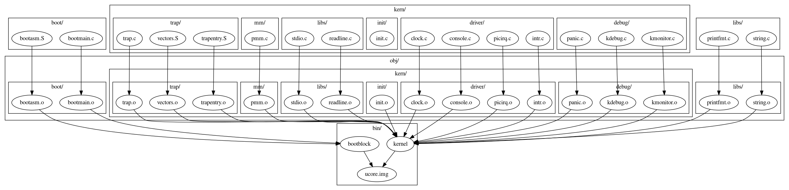

> #### 练习1：理解通过make生成执行文件的过程。（要求在报告中写出对下述问题的回答）
>
> 列出本实验各练习中对应的OS原理的知识点，并说明本实验中的实现部分如何对应和体现了原理中的基本概念和关键知识点。
>
> 在此练习中，大家需要通过静态分析代码来了解：
>
> 1. 操作系统镜像文件ucore.img是如何一步一步生成的？(需要比较详细地解释Makefile中每一条相关命令和命令参数的含义，以及说明命令导致的结果)
> 2. 一个被系统认为是符合规范的硬盘主引导扇区的特征是什么？
>
> 补充材料：
>
> 如何调试Makefile
>
> 当执行make时，一般只会显示输出，不会显示make到底执行了哪些命令。
>
> 如想了解make执行了哪些命令，可以执行：
>
> ```
> $ make "V="
> ```
>
> 要获取更多有关make的信息，可上网查询，并请执行
>
> ```
> $ man make
> ```




一个非常好的结构（来源：https://xr1s.me/2018/05/15/ucore-lab1-report/）

lab1 包含了两个 makefile 文件，一个位于实验目录下，另一个位于 `./tools/function.mk` 下。可以推测另一个 makefile 文件主要定义了函数。

在文档中提到 `make "V="` 可以查看日志，刚开始没看懂，后来查文档才明白它自己实现了一个 `V:=@`。而在 Makefile 中，`@` 可以关闭回显，制作这样一个变量可以控制我们想要显示的输出。

对于问题一而言，通过 log 我们可以看到，它首先编译了 `libs` 和 `kern` 下所有的  .c 文件，生成了 `bin/kernel`，之后编译了 `boot` 下的文件，生成 `bin/bootblock` 这个文件。这个过程还是蛮 tricky 的，我们看到的这段 log 大概是这样子的：

```
+ cc boot/bootasm.S
gcc -Iboot/ -fno-builtin -fno-PIC -Wall -ggdb -m32 -gstabs -nostdinc  -fno-stack-protector -Ilibs/ -Os -nostdinc -c boot/bootasm.S -o obj/boot/bootasm.o
+ cc boot/bootmain.c
gcc -Iboot/ -fno-builtin -fno-PIC -Wall -ggdb -m32 -gstabs -nostdinc  -fno-stack-protector -Ilibs/ -Os -nostdinc -c boot/bootmain.c -o obj/boot/bootmain.o
+ cc tools/sign.c
gcc -Itools/ -g -Wall -O2 -c tools/sign.c -o obj/sign/tools/sign.o
gcc -g -Wall -O2 obj/sign/tools/sign.o -o bin/sign
+ ld bin/bootblock
ld -m    elf_i386 -nostdlib -N -e start -Ttext 0x7C00 obj/boot/bootasm.o obj/boot/bootmain.o -o obj/bootblock.o
'obj/bootblock.out' size: 488 bytes
```

它首先编译出了 `bootasm.o` 和 `bootmain.o`，而我们看到的相关的 Makefile 代码是这样子的：

```makefile
# create bootblock
bootfiles = $(call listf_cc,boot)
$(foreach f,$(bootfiles),$(call cc_compile,$(f),$(CC),$(CFLAGS) -Os -nostdinc))

bootblock = $(call totarget,bootblock)

$(bootblock): $(call toobj,$(bootfiles)) | $(call totarget,sign)
	@echo + ld $@
	$(V)$(LD) $(LDFLAGS) -N -e start -Ttext 0x7C00 $^ -o $(call toobj,bootblock)
	@$(OBJDUMP) -S $(call objfile,bootblock) > $(call asmfile,bootblock)
	@$(OBJCOPY) -S -O binary $(call objfile,bootblock) $(call outfile,bootblock)
	@$(call totarget,sign) $(call outfile,bootblock) $(bootblock)

$(call create_target,bootblock)
```

`bootfiles` 进行了编译，`bootblock` 则进行了接下来的过程。

刚开始没有看懂为什么它还生成了 `bootblock.out`，接着看 Makefile 就能看见它隐式地调用了 objcopy，也就是说，它先生成了 `bootblock.o`，然后通过该函数生成了 `bootblock.out`。接下来则是调用 `tools/sign` 进行检测，根据 `sign.c` 和 `Makefile` 中的代码，不难判断，传入检测的参数分别是 `bin/bootblock.out` 和 `bin/bootblock`。而 `sign.c` 则是另外一段比较有趣的文件了。

在 `sign.c` 中，`stat` 结构体将文件加载进来，之后进行判断。分析 `sign.c` 就是回答第二问了。根据逻辑我们可以得到如下结论，一个被系统认为是符合规范的硬盘主引导扇区的特征有：

- 有且只有 512 字节
- 最后两位是 `0x55 0xAA`

回到 Makefile 中，主引导区合法后继续链接 `ucore` 。log 如下：

```
dd if=/dev/zero of=bin/ucore.img count=10000
10000+0 records in
10000+0 records out
5120000 bytes (5.1 MB, 4.9 MiB) copied, 1.86576 s, 2.7 MB/s
dd if=bin/bootblock of=bin/ucore.img conv=notrunc
1+0 records in
1+0 records out
512 bytes copied, 0.00074265 s, 689 kB/s
dd if=bin/kernel of=bin/ucore.img seek=1 conv=notrunc
146+1 records in
146+1 records out
74828 bytes (75 kB, 73 KiB) copied, 0.0417151 s, 1.8 MB/s
```

首先从 `/dev/zero`创建 `bin/ucore` 文件，接着按照逐字节的方式将 `bootblock` 和 `kernel` 拷贝进去。

接下来我们分析一下编译过程中调用的程序的相关参数。

gcc 编译命令样例：

```bash
gcc -Ikern/init/ -fno-builtin -fno-PIC -Wall -ggdb -m32 -gstabs -nostdinc  -fno-stack-protector -Ilibs/ -Ikern/debug/ -Ikern/driver/ -Ikern/trap/ -Ikern/mm/ -c kern/init/init.c -o obj/kern/init/init.o
```

- `-fno-builtin`：如果是内建函数，需要在开头添加 `__builtin_`。这样可以规避某些命名冲突的问题。
- `-fno-PIC`：不产生位置无关代码，即产生的代码都是绝对地址。嘛，因为内核代码在内存中的位置始终是固定的，所以需要加这个参数。
- `-Wall`：warning all，显示全部的警告信息。
- `-ggdb`：生成尽可能多的可供 gdb 调试的信息。
- `-m32`：生成兼容 32 位 x86 环境的指令。
- `-gstabs`：此选项以 stabs 格式声称调试信息，但是不包括 gdb 调试信息。根据某些资料，stabs 格式的调试信息似乎特别适合用于内核调试。
- `-nostdinc`：和下面的 `-I<DIR>` 指令搭配，使编译器不再系统缺省的头文件目录里面找头文件，明确限定头文件的位置。
- `-fno-stack-protector`：禁用堆栈（canary）保护。在堆栈保护情况下每个函数中会增加检查堆栈的指令。
- `-I`：格式 `-I<DIR>`。将目录加入到搜索头文件的目录列表中，可以用 `#include<>` 以包含。
- `-c`：只编译并汇编，不产生链接，生成的是可重定位文件。
- `-o`：输出的文件名。

ld 命令样例：

```bash
ld -m	elf_i386 -nostdlib -T tools/kernel.ld -o bin/kernel  obj/kern/init/init.o obj/kern/libs/stdio.o obj/kern/libs/readline.o obj/kern/debug/panic.o obj/kern/debug/kdebug.o obj/kern/debug/kmonitor.o obj/kern/driver/clock.o obj/kern/driver/console.o obj/kern/driver/picirq.o obj/kern/driver/intr.o obj/kern/trap/trap.o obj/kern/trap/vectors.o obj/kern/trap/trapentry.o obj/kern/mm/pmm.o  obj/libs/string.o obj/libs/printfmt.o
ld -m	elf_i386 -nostdlib -N -e start -Ttext 0x7C00 obj/boot/bootasm.o obj/boot/bootmain.o -o obj/bootblock.o
```

- `-m`：指明生成文件格式

- `-nostdlib`：不链接标准库

- `-T`：运行用 `ld` 语言写的链接脚本

  - > 链接脚本是用来指明各个段的位置还有入口之类的链接信息的。

- `-o`：指明输出文件名

- `-N`：把 text 和 data 节设置为可读写。取消数据节的页对齐，取消对共享库的连接。

- `-e`：`--entry`，设置程序入口地址。

  - > 默认是 `_start` ，这里设置为入口函数 `kern_init` 以便随后 boot 进入保护模式后可以直接 jump 到 entry point 函数。

- `-Ttext`：指明 `text` 节在运行时的内存地址。

  - > 以便于符号重定位。

dd 命令样例：

```bash
dd if=/dev/zero of=bin/ucore.img count=10000
dd if=bin/kernel of=bin/ucore.img seek=1 conv=notrunc
```

- `if`：输入文件
- `of`：输出文件
- `count`：读取并写入的 block size 数，其中 block size 的默认大小是 512 字节。
- `seek`：跳过写入文件的 block size 数，可以看到写入内核的时候跳过了 512 字节，正好是 boot 文件的大小。
- `conv`：转换选项 `notrunc` 意味着不缩减输出文件，也就是说，如果输出文件已经存在，只改变指定的字节，然后退出，并保留输出文件的剩余部分。没有这个选项，`dd` 将创建一个512字节长的文件。

这样的话练习一就基本上做完了。。有点迫不及待地往下看了。而且我写这个笔记用了好长时间。。

另外，Makefile 文件还没有完整地分析，里面 tricky 的东西太多了。。

# 参考资料：

[跟我一起写Makefile](https://seisman.github.io/how-to-write-makefile/index.html)

[GCC 参数详解](http://www.cppblog.com/SEMAN/archive/2005/11/30/1440.html)

[GCC 中的编译器堆栈保护技术](https://www.ibm.com/developerworks/cn/linux/l-cn-gccstack/index.html)

[ucore lab1 实验报告](https://xr1s.me/2018/05/15/ucore-lab1-report/)

[dd (Unix)](https://zh.wikipedia.org/wiki/Dd_(Unix))