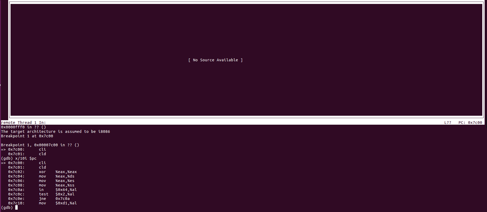

> 为了熟悉使用qemu和gdb进行的调试工作，我们进行如下的小练习：
>
> 1. 从CPU加电后执行的第一条指令开始，单步跟踪BIOS的执行。
> 2. 在初始化位置0x7c00设置实地址断点,测试断点正常。
> 3. 从0x7c00开始跟踪代码运行,将单步跟踪反汇编得到的代码与bootasm.S和 bootblock.asm进行比较。
> 4. 自己找一个bootloader或内核中的代码位置，设置断点并进行测试。

这个练习就是锻炼自己使用软件的能力啦。

对于第一题，参考[附录“启动后第一条执行的指令”](https://chyyuu.gitbooks.io/ucore_os_docs/content/lab1/lab1_5_appendix.html)，在 `tools/gdbinit` 文件中添加：

```
set architecture i8086
```

之后 `make debug`，`info r`，在输出的内容中看到我们停在了 `0x10000 <kern_init>` 处。

对于第二题，参考视频中的做法，添加：

```
b *0x7c00
```

即可。大概是这么个效果：



加载 pwndbg 的话会乱码而且由于架构不同不识别。我就没有加载。可以考虑手动改一下。。

对于第三问，和 bootasm.S 和 bootblock.asm 进行比较的话，我只能说和正常编译出来的文件差不多吧。虽然寄存器用的是 %exx，但是只有低位有效；所有的符号都变成了地址。基本上没有任何优化。

练习四的话就不做了。。之前做的也够多了。下断点要么找在函数处下断点（break 符号）要么直接在地址上下断点（break 地址）

另外 `x/i $pc` 可以反汇编出代码，小本本记下来。。我的忘性太大了。。