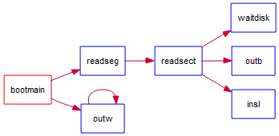

> #### 练习4：分析bootloader加载ELF格式的OS的过程。（要求在报告中写出分析）
>
> 通过阅读bootmain.c，了解bootloader如何加载ELF文件。通过分析源代码和通过qemu来运行并调试bootloader&OS，
>
> - bootloader如何读取硬盘扇区的？
> - bootloader是如何加载ELF格式的OS？
>
> 提示：可阅读“硬盘访问概述”，“ELF执行文件格式概述”这两小节。

通过 Understand，我们可以看到它的结构大概是这个样子的：



对于 `readseg` 函数，其功能是从内核数据（ROM）中读取大小为 count 的字节传入虚拟内存中。按照注释，它可能比传入的参数复制更多字节。虽然会占用更多的内存，但是操作系统就是这么任性啊XD

对于 `bootmain` 来讲，它要复制到的位置是 0x10000。`readseg` 还处理了扇区边界对齐的问题。

接着传输数据，将字节偏移转换为扇区的编号也就是它定义的 `secno`。内核从第一个扇区开始运行。总计读取了 8 个扇区。

然后就是读入的过程。`readsect` 函数就是具体的读取函数。

根据[硬盘访问概述](https://chyyuu.gitbooks.io/ucore_os_docs/content/lab1/lab1_3_2_3_dist_accessing.html)，传入 LBA 的参数是 `secno`。读 0x1F7 的状态寄存器，第四位为 0 表示读写完成（空闲），也就是我们看到的 `waitdisk` 函数。接下来写 0x1F2 表示只写一个扇区，接下来写 0x1F3\~0x1F6 是传入 LBA 模式的参数。最后写 0x1F7 的命令寄存器，0x20 代表读数据的指令。接下来读一个扇区。它的详细代码是 `insl(0x1F0, dst, SECTSIZE / 4);`。这是一段内联汇编，我们可以仔细分析这段代码：

```c
static inline void
insl(uint32_t port, void *addr, int cnt) {
    asm volatile (
            "cld;"
            "repne; insl;"
            : "=D" (addr), "=c" (cnt)
            : "d" (port), "0" (addr), "1" (cnt)
            : "memory", "cc");
}
```

`dst` 就是要写的虚拟地址。按照内联汇编的格式，输出的是 `"=D" (addr), "=c" (cnt)`，输入是 `"d" (port), "0" (addr), "1" (cnt)`，Clobber 的内容是会被修改的内容。 memory 指内存，cc 指的是标志寄存器（因为 DF 会变）。

唔，分析了这么久，我们总算是把 bootmain 中的第一条命令分析完了 OTZ。接下来会检测 ELF 的 magic number 是否正确。然后将 ELF 的相关的段加载进内存中。这里面主要用到了这几个 ELFHeader 中的数据结构：

- e_phoff：program header 表的位置偏移
- e_phnum：program header 表的入口数目

Program Header：

- p_va：段的第一个字节将被放到内存中的虚拟地址
- p_memsz：段在内存映像中占用的字节数
- p_offset：段相对文件头的偏移

嘛，练习四大概就是这样了。

# 参考资料

[读取磁盘：LBA方式](https://www.cnblogs.com/mlzrq/p/10223060.html)

[GCC Inline ASM](http://www.nagain.com/activity/article/18/)