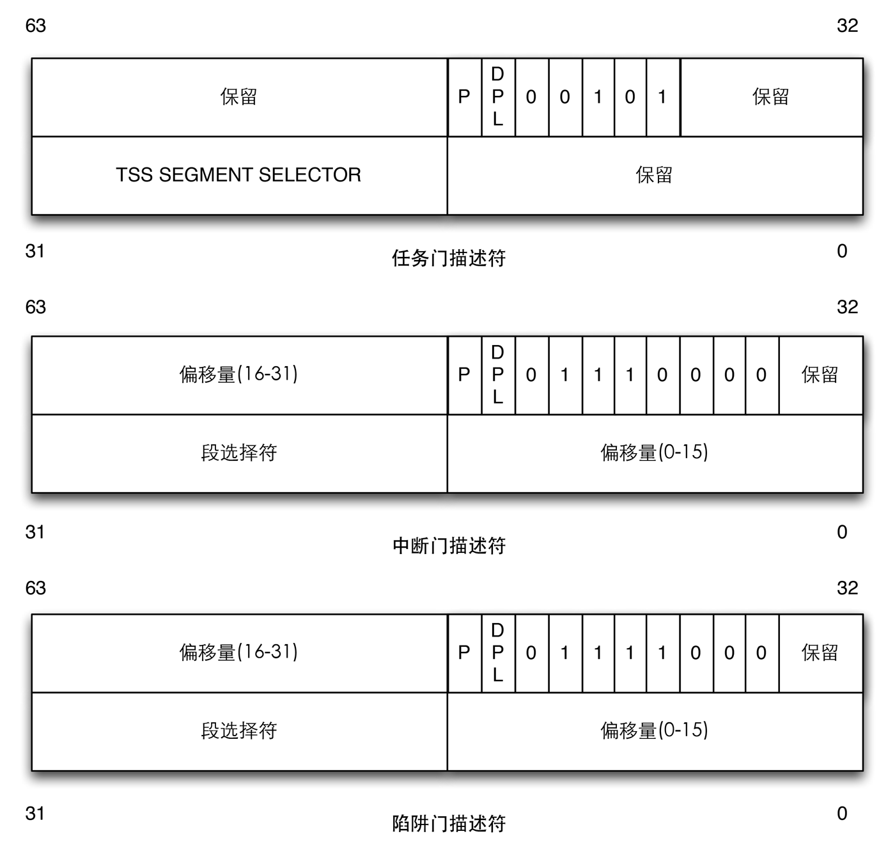
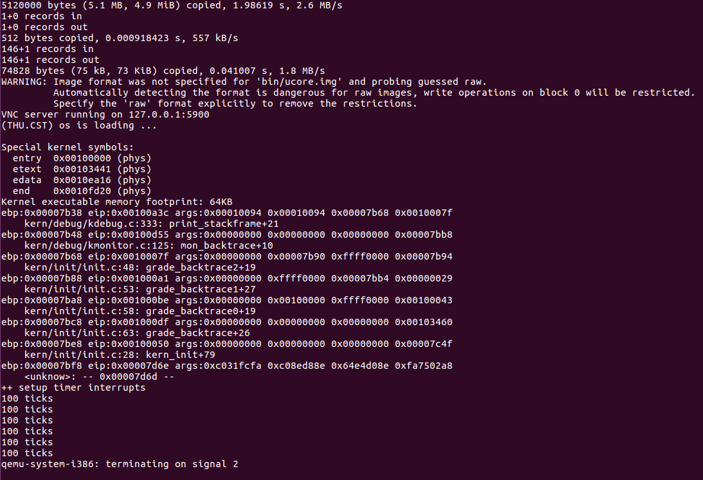
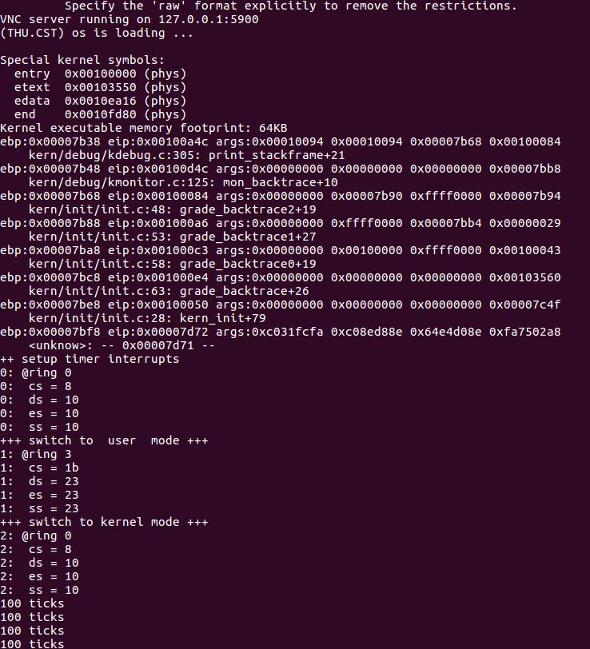

> 请完成编码工作和回答如下问题：
>
> 1. 中断描述符表（也可简称为保护模式下的中断向量表）中一个表项占多少字节？其中哪几位代表中断处理代码的入口？
> 2. 请编程完善kern/trap/trap.c中对中断向量表进行初始化的函数idt_init。在idt_init函数中，依次对所有中断入口进行初始化。使用mmu.h中的SETGATE宏，填充idt数组内容。每个中断的入口由tools/vectors.c生成，使用trap.c中声明的vectors数组即可。
> 3. 请编程完善trap.c中的中断处理函数trap，在对时钟中断进行处理的部分填写trap函数中处理时钟中断的部分，使操作系统每遇到100次时钟中断后，调用print_ticks子程序，向屏幕上打印一行文字”100 ticks”。

第一题是对中断描述符表结构的叙述。

参考下面的结构：



> 引用自[中断描述符表](<http://guojing.me/linux-kernel-architecture/posts/interrupt-descriptor-table/>)

中断描述符表中的一个表项占 8 字节。根据文档，在 ucore 中，我们没有用到 Task-gate descriptor，只用到了 Interrupt-gate descriptor 和  Trap-gate descriptor。

中断表的结构在 `kern/mm/mmu.h` 中给出。

```c
/* Gate descriptors for interrupts and traps */
struct gatedesc {
    unsigned gd_off_15_0 : 16;        // low 16 bits of offset in segment
    unsigned gd_ss : 16;            // segment selector
    unsigned gd_args : 5;            // # args, 0 for interrupt/trap gates
    unsigned gd_rsv1 : 3;            // reserved(should be zero I guess)
    unsigned gd_type : 4;            // type(STS_{TG,IG32,TG32})
    unsigned gd_s : 1;                // must be 0 (system)
    unsigned gd_dpl : 2;            // descriptor(meaning new) privilege level
    unsigned gd_p : 1;                // Present
    unsigned gd_off_31_16 : 16;        // high bits of offset in segment
};
```

在操作系统处理中断时，中断描述符表中的 0~1 字节和 6~7 字节拼接形成 32 位的段中偏移，2~3 字节是段选择子，和偏移”联合“就可以得到中断服务程序的地址。 TODO: 补充详细的过程。

对于问题 2，查看 `SETGATE(gate, istrap, sel, off, dpl)` 的注释，`gate` 代表运行时建立的中断门，`istrap` 代表是异常还是中断，`sel` 代表服务程序的代码段选择子，`off` 代表服务程序在代码段中的偏移，`dpl` 就是描述符的权限了。在初始化的过程中，`gate` 的范围是 `sizeof(idt)/sizeof(struct gatedesc)` 也就是 256。由于是中断，`istrap` 初始化为 0。`sel` 参数填充为全局段描述符的数值，在 `kern/mm/memlayout.h` 中的 `GD_KTEXT`。`off` 的值是中断服务例程的入口地址，也就是 `__vectors`。`dpl` 为内核态的权限，即 `DPL_KERNEL`。

然而并非所有的中断特权级都是内核态，系统调用中断（T_SYSCALL）需要能在用户态调用，实现用户态和内核态的切换，因此需要另外设置这个中断的特权级。

第二问的最后一步要通过 `lidt` 通知 CPU IDT 的位置。`lidt` 将输入的（地址）加载进中断描述符表寄存器（IDTR）。我们在上面定义了 `pseudodesc` `idt_pd`，只需要把它加载进去就可以了。

综上，第二问的代码如下所示：

```c
	extern uintptr_t __vectors[];
    int i;
    for(i = 0; i < sizeof(idt) / sizeof(struct gatedesc); ++i){
        SETGATE(idt[i], 0, GD_KTEXT, __vectors[i], DPL_KERNEL);
    }
    SETGATE(idt[T_SYSCALL], 0, GD_KTEXT, __vectors[T_SYSCALL], DPL_USER);
    lidt(&idt_pd);
```

对于第三问，中断处理函数 `trap` 会调用 `trap_dispatch`，我们在这里写第三问的答案。

根据注释，其实代码已经可以写出来了。。

```c
		++ticks;
        if(ticks % TICK_NUM == 0){
            print_ticks();
        }
        break;
```

于是乎我们 `make qemu`，大概能得到下图的形式：



然而对比答案的输出似乎少了些什么？

答案输出如下：



嗯。。缺少了用户态与内核态的转换。

问题出现在哪里呢？很可能是第二问中

> 【注意】除了系统调用中断(T_SYSCALL)使用陷阱门描述符且权限为用户态权限以外，其它中断均使用特权级(DPL)为０的中断门描述符，权限为内核态权限；而ucore的应用程序处于特权级３，需要采用｀int 0x80`指令操作（这种方式称为软中断，软件中断，Tra中断，在lab5会碰到）来发出系统调用请求，并要能实现从特权级３到特权级０的转换，所以系统调用中断(T_SYSCALL)所对应的中断门描述符中的特权级（DPL）需要设置为３。

这一项没有满足。然后我祭出了 diff 工具进行比较。。发现原来是 challenge 中的题目。。吐血，还好没在这上面投入太多时间😂。

这样，练习 6 就完成啦。

# 参考资料

[OSDev.org](http://www.osdev.org/)

[中断描述符表](<http://guojing.me/linux-kernel-architecture/posts/interrupt-descriptor-table/>)