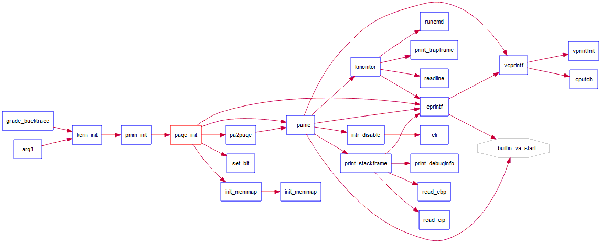

练习 1 要实现 fisrt-fit 算法。

default_pmm.h 和 default_pmm.c 中有一个 pmm_manager 结构体，设定好了一个连续物理内存分配算法的一些主要的函数实现。

在实验中需要重点实现分配、释放，要注意实现初始化：知道哪些是空闲的以进行动态分配（init_memmap）

最后完成检查函数：判断是否正确，check函数

free_pages 函数：知道还有多少空闲页。

我们可以通过如下命令查找需要填写的地方：

```bash
find . -name "*.[chS]" -exec grep -Hn LAB2 {} \;
```

```bash
$ find . -name "*.[chS]" -exec grep -Hn LAB2 {} \;
./kern/mm/default_pmm.c:15:// LAB2 EXERCISE 1: YOUR CODE
./kern/mm/default_pmm.c:237:// LAB2: below code is used to check the first fit allocation algorithm (your EXERCISE 1) 
./kern/mm/pmm.c:329:    /* LAB2 EXERCISE 2: YOUR CODE
./kern/mm/pmm.c:382:    /* LAB2 EXERCISE 3: YOUR CODE
```

可以看到，有关练习 1 的内容基本上都在 default_pmm.c 中。

有关 first-fit 算法的理论内容，在慕课的[第五讲](../theory/第五讲.md)有提到过。在这里摘抄如下：

> ## 最先匹配策略
>
> - 思路
>
> 分配 n 个字节，使用第一个可用的空间比 n 大的空闲块。
>
> - 原理/实现
>   - 空闲分区列表按地址顺序排序
>   - 分配过程时，搜索第一个合适的分区
>   - 释放分区时，检查是否可与临近的空闲分区合并
> - 优点
>   - 简单
>   - 在高地址空间有大块的空闲分区
> - 缺点
>   - 外部碎片
>   - 分配大块时较慢

接下来我们就可以具体地分析练习 1 了。

慕课推荐把前面的一大块注释看完，我直接把它翻译一下吧。

> 在最先匹配算法中，分配器维护一个空闲块的列表。一旦收到内存分配的请求，它会在搜索这个列表并将满足请求的第一个内存块分配出去。如果要分配的内存块明显大于需要的内存块，分配器会切开内存块，并将剩余的内存块加入到空闲块的列表中。推荐阅读严蔚敏《数据结构（C语言版）》的 196~198 页中的 8.2 章节（可以参考[这里](https://github.com/HongYiMU/TheAlgorithm/blob/master/%5B%E6%95%B0%E6%8D%AE%E7%BB%93%E6%9E%84(C%E8%AF%AD%E8%A8%80%E7%89%88)%5D.%E4%B8%A5%E8%94%9A%E6%95%8F_%E5%90%B4%E4%BC%9F%E6%B0%91.%E6%89%AB%E6%8F%8F%E7%89%88_%E6%9C%89%E7%9B%AE%E5%BD%95.pdf)）

这个和我上面的那一部分引用差不多。严老师教材里面这一章的内容讲的是可利用空间表既分配方法，我觉得还是挺值得一看的。

> Lab2 exercise1
>
> 应当改写 `default_init`、`default_init_memmap`、`default_alloc_pages`、`default_free_pages` 函数
>
> FFMA 的细节（First-Fit Memory Allocation）
>
> -  (1) 准备
>
>   为了实现 FFMA，我们需要用一个列表管理空闲内存区域。`free_area_t` 结构体被用来管理空闲内存块。
>
>   首先你需要熟悉 `list.h` 中的 `list` 结构体。`list` 结构体是一个简单的双向链表。你需要直到如何利用 `list_init`、`list_add(list_add_after)`、`list_add_before`、`list_del`、`list_next`、`list_prev` 这些函数。
>
>   从普通的 `list` 结构体转变为其他特殊的结构体（如 `page` 等）用了一个有趣的方法，用如下的宏可以达到效果：`le2page`(memlayout.h)，在未来的实验中还会用到 `le2vma`(vmm.h)、`le2proc`(proc.h) 等。

貌似我这个版本的 `list` 叫做 `list_entry`，它的定义是

```c
struct list_entry {
    struct list_entry *prev, *next;
};
```

`list_init` 函数会建立只有一个结点的列表

`list_add` 函数会调用 `list_add_after`，`list_add_after` 会调用 `__list_add`，并传参数 `(elm, listelm, listelm->next)`。

`list_add_before` 也会调用 `__list_add`，我们只需要记住它的定义，注意一下参数就可以了。

`list_del` 会释放掉一个内存块。但是相应的结构体内存空间没有释放掉。

`list_next` 会返回下一个内存块的地址。

`list_prev` 会返回前一个内存块的地址。

对于转换的函数，我们可以先分析 `Page` 这个结构体。

对于这个结构体，相应的解释如下：

> Page 结构体 - 页描述符结构体。每一个页结构体描述一个物理页。在 `kern/mm/pmm.h` 中，你可以找到一系列可以将 Page 转换为其他数据类型的有用函数，例如物理地址。

Page 结构体内容如下：

```c
struct Page {
    int ref;                        // page frame's reference counter
    uint32_t flags;                 // array of flags that describe the status of the page frame
    unsigned int property;          // the num of free block, used in first fit pm manager
    list_entry_t page_link;         // free list link
};
```

我们比较关注 `le2page` 这个宏。

```c
// convert list entry to page
#define le2page(le, member)                 \
    to_struct((le), struct Page, member)
```

`to_struct` 这个宏定义如下：

```c
/* *
 * to_struct - get the struct from a ptr
 * @ptr:    a struct pointer of member
 * @type:   the type of the struct this is embedded in
 * @member: the name of the member within the struct
 * */
#define to_struct(ptr, type, member)                               \
    ((type *)((char *)(ptr) - offsetof(type, member)))
```

`offsetof` 这个宏会返回 `member` 相对于 `struct` 类型开头的偏移量。

嗯。。其实有点没理解，先接着往后看吧。

> - (2)`default_init`
>
>   你可以重用样例的 `default_init` 函数以初始化 `free_list` 并将 `nr_free` 设为 0。`free_list` 用来记录空闲的内存块，`nr_free` 是空闲内存块的总数。

这个意思应该是不必修改 `default_init` 吧。

> - (3)`default_init_memmap`
>
>   调用顺序：
>
>   `kern_init` --> `pmm_init` --> `page_init` --> `init_memmap` --> `pmm_manager` --> `init_memmap`
>
>   这个函数用来初始化一个空闲的内存块（带参数：`addr_base`、`page_number`）为了初始化一个内存块，首先你需要初始化空闲块的每一页（定义在 memlayout.h）。这一步包括：
>
>   - 设置 `p->flags` 中的 `PG_property` 标志位，这意味着该页是可用的。
>
>     PS：在 `pmm_init` 函数(pmm.c)中，`p->flags` 中的 `PG_reserved` 位已经被设置了。
>
>   - 如果该页空闲并且没有位于空闲块的第一页，`p->property` 需要设置为 0。
>
>   - 如果该页空闲并且位于空闲块的第一页，`p->property` 需要设置为该块的页的总数。
>
>   - 由于现在的 p 是空闲的而且没有被引用，`p->ref` 应设为 0。
>
>   之后，我们可以用 `page_link` 将这一页连接到 `free_list` 中（例如 `list_add_before(&free_list, &(p->page_link))`）
>
>   最后，我们应该更新空闲内存块的总和：`nr_free += n`。



这里有一个比较重要的结构体 `pmm_maneger`：

> `pmm_manager` 是一个管理物理内存的类。一个特殊的 pmm manager —— 可以称为 XXX_pmm_manager 只需要在 pmm_manager 类中完成设置，之后 XXX_pmm_manager 就可以被 ucore 用来完成对所有物理内存空间的管理了。

```c
struct pmm_manager {
    const char *name; // XXX_pmm_maneger 的名字
    void (*init)(void); // 初始化内部描述&管理的数据结构
    					// XXX_pmm_manager 的空闲的块列表、空闲块的数量
    void (*init_memmap)(struct Page *base, size_t n); // 根据最初的空闲物理内存空间设置描述符&管理数据结构
    struct Page *(*alloc_pages)(size_t n); // 根据分配算法分配>=n的页
    void (*free_pages)(struct Page *base, size_t n);  // 根据在 memlayout.h 中的页描述符结构中定义的基址释放>=n的页
    size_t (*nr_free_pages)(void); // 返回空闲页的数量
    void (*check)(void); // 检查 XXX_pmm_manager 是否正确。
};
```
pmm_init 会调用 `init_pmm_manager`，设置 pmm_manager 为 default_pmm_manager。

page_init 函数(pmm.c) 中会调用 `init_memmap`。


> - (4)`default_alloc_pages`
>
> 搜索空闲块列表中块的大小>=申请的空间大小的第一个空闲块并调整其大小，返回 `malloc` 请求的该块的地址。
>
>   - (4.1) 所以你可以像这样搜索空闲列表：
>
>  ```c
>  list_entry_t le = &free_list;
>  while((le=list_next(le)) != &free_list){
>      ...
>  ```
>
> - - (4.1.1)
>
>    在 while 循环中，得到 `page` 结构体后检查 `p->property` 是否有效（记录此块中的空闲页数）>=n。
>
>    ```c
>    struct Page *p = le2page(le, page_link);
>    if(p->property >= n){
>        ...
>    ```
>
> - - (4.1.2)
>
>    如果我们找到了满足条件的 `p`，这意味着我们找到了一个前 `n` 页可以被内存分配的，块大小大于等于 n 的块。这一页的标志位应该设置如下：
>
>    `PG_reserved = 1;`
>
>    `PG_property = 0;`
>
>    之后，取消 `free_list` 中 `page` 的连接。
>
>       - (4.1.2.1)
>     
>      如果 `p->property > n`，我们应当重新计算这个空闲块的剩余页值。（例如：`le2page(le, page_link)->property = p->property - n;`）
>     
>     - (4.1.3)
>
>    重新计算 `nr_free`（所有空闲块的剩余数量）
>
>     - (4.1.4)
>
>    返回 `p`。
>
>   - (4.2)
>
>  如果我们不能找到这样的大小大于等于 n 的内存块，返回 NULL。
>
> - (5)`default_free_pages`
>
> 重新连接 pages 到空闲列表中，并且尽可能将小的空闲的区域合并为大的空闲区域。
>
>   - (5.1)
>
>  根据回收的块的基址，搜索到它的正确的位置（从低到高排序）并插入 `pages`（可能会用到 `list_next`、`le2page`、`list_add_before`）
>
>   - (5.2)
>
>  重置 pages 中的域，例如 `p->ref` 和 `p->flags`（页的属性）
>
>   - (5.3)
>
>  尝试将比它更低的或更高内存区域的地址合并。注意，这应当正确修改一些 pages 中的 `p->property`。