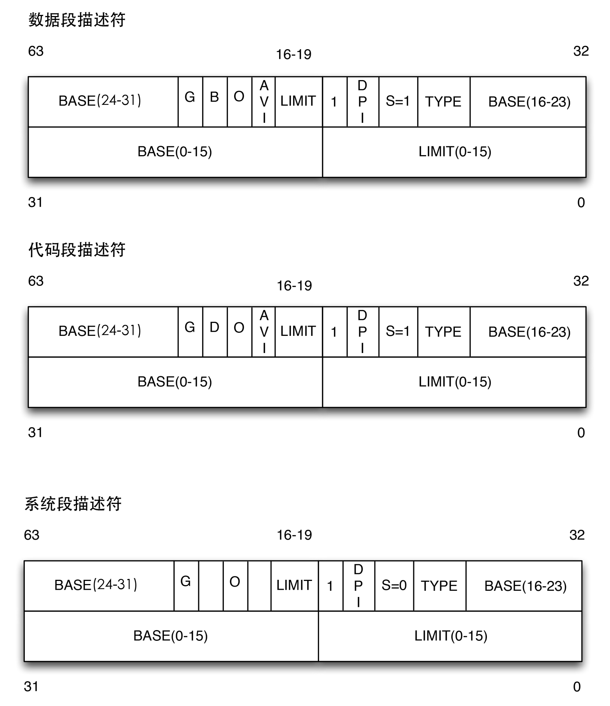

# 7.1 了解 x86 保护模式中的特权级

## x86 特权级 —— 简介

- 操作系统课程实验2——物理内存管理

- x86 特权级（privilege levels）
- x86 内存管理单元（MMU）

操作系统如何利用CPU建立保护机制

操作系统怎么利用MMU实现内存映射

## x86 特权级

- 了解不同特权级的差别
- 了解当前 CPU 处在哪个特权级
- 了解特权级切换

Linux 和 ucore 只使用 ring0 和 ring3

## x86 特权级——区别？

- 一些指令（特权指令）只能执行在 ring 0（lgdt）

- CPU 在如下时刻会检查特权级
  - 访问数据段
  - 访问页
  - 进入中断服务例程（ISRs）
- 检查失败？

## 段选择子


> 引用自 http://guojing.me/linux-kernel-architecture/posts/segment-selector/



RPL：当前访问数据段的特权级，DS、ES、FS、GS

CS:CPL：当前代码段的特权级，CS、SS

# 7.2 了解特权级切换过程

## 通过中断切换特权级

中断门 - 中断描述符表实现跳转

我怎么感觉这里讲的内容都在 lab1 中分析过了。。

堆栈信息存储的位置：位于任务状态段 Task-State Segment

TSS 格式，在 x86 特权级中存储信息，设置新的堆栈（从 ring3 跳到 ring0）

TSS Descriptor

## x86 特权级 - 栈切换中获取新的栈

Task Register 缓存 TSS 的内容

## x86 特权级 - 建立 TSS

```
Alloc TSS memory    pmm.c

Init TSS 

Fill TSS descriptor in GDT

set TSS sector
```

# 7.3 了解段/页表

## x86 MMU - 段机制概述

基址 + 偏移

虚拟地址 -> 线性地址

## x86 MMU - 段选择子(segment selector)中的隐藏部分

- 基址（Base address）一直被存放在隐藏部分。直到选择子发生变化，才会更新基址内容（即新的段表项中的基址值）

## 建立 GDT tables（kernel init）

# 7.4 了解 ucore 建立段/页表

## 页机制概述

Linear Address: offset 12, Table 10, Directory 10

Page Directory: Page Table Address

Page Table: 4-K Byte Page, Physical Address

线性地址 -> 物理地址（段机制：虚拟地址 -> 线性地址）对等映射

## 页机制举例

## 页表项（page table entries）

- R/W: 1 if this page is writable
- U/S:1 if ring 3
- A: 1 if accessed
- may ignore others for now

## 使能页机制（enable paging）

- 在保护下使能页机制

## 建立页表

ucore - pmm.c

## 在页表中建立页的映射关系

## 合并段机制+页机制

# 7.5 演示 LAB2 实验环节

```
grep lab2
```

